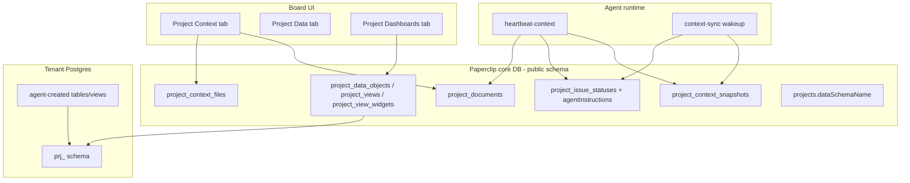
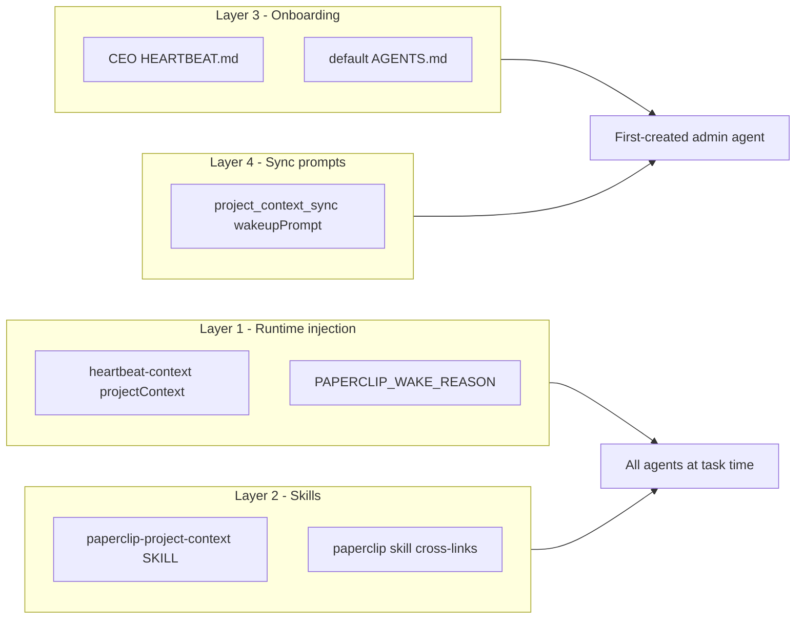
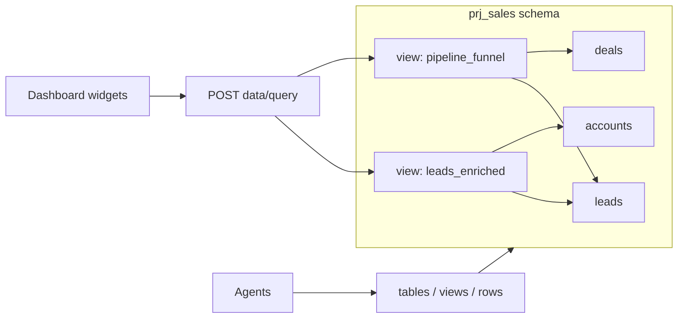
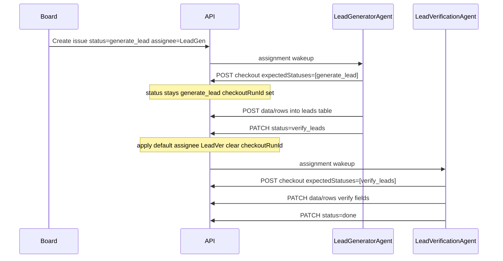

# Project Context System

## Current baseline

Paperclip already has strong primitives to build on, but **no project-level knowledge store**:


| Exists today                                                                                                                                       | Gap                                                |
| -------------------------------------------------------------------------------------------------------------------------------------------------- | -------------------------------------------------- |
| `[documents](packages/db/src/schema/documents.ts)` + `[issue_documents](packages/db/src/schema/issue_documents.ts)` (company-scoped, issue-linked) | No `project_documents` or project file context     |
| `[GET /api/issues/:id/heartbeat-context](server/src/routes/issues.ts)` with `projectWorkflow`                                                      | No project summary, docs, or stage playbooks       |
| `[project_issue_statuses](packages/db/src/schema/project_issue_statuses.ts)` with `allowedActors`, transitions                                     | No per-stage agent instructions / capability hints |
| Routines + `heartbeat.wakeup` automation (`[connectors.ts](server/src/services/connectors.ts)` pattern)                                            | No context-sync background agent                   |
| Draft plan `[doc/plans/project-agent-data-schemas.md](doc/plans/project-agent-data-schemas.md)`                                                    | Per-project schemas + dashboards not implemented   |
| `[StorageService](server/src/storage/service.ts)` + `[assets](packages/db/src/schema/assets.ts)`                                                   | Uploads only for logos/issue attachments today     |


## Target architecture




---

## 1. Data model (Drizzle + migration)

Add new schema files under `[packages/db/src/schema/](packages/db/src/schema/)` and export from `index.ts`.

### 1a. Project context (knowledge)

`**project_documents**` — mirror `[issue_documents](packages/db/src/schema/issue_documents.ts)`:

- `companyId`, `projectId`, `documentId`, `key` (unique per project, slug)
- Reserved keys: `summary` (AI-maintained **current** summary — canonical for UI + heartbeat), `brief`, `spec`, `workflow` (optional human override)
- `**project_context_snapshots`** = append-only history only; current summary always read from keyed doc `summary` (latest snapshot = most recent history entry)

`**project_context_files`** — uploaded assets with extracted text:

- `id`, `companyId`, `projectId`, `assetId` (FK → `assets`)
- `title`, `originalFilename`, `contentType`, `byteSize`
- `extractionStatus`: `pending | processing | complete | failed | skipped`
- `extractedText` (text, nullable), `extractionError` (text, nullable)
- `uploadedByUserId`, `uploadedByAgentId`, timestamps

`**project_context_snapshots**` — versioned generated summaries:

- `id`, `companyId`, `projectId`
- `kind`: `project_summary | workflow_summary`
- `body` (markdown), `contentHash` (invalidation fingerprint)
- `generatedByAgentId`, `generatedByRunId` (nullable), `revisionNumber`
- timestamps

`**project_maintenance_requests**` — business user → agent change requests (audit + optional tracking):

- `id`, `companyId`, `projectId`
- `type`: `context_summary | dashboards | workflow`
- `description` (text), `contextRef` (jsonb, nullable — e.g. `{ viewId, documentKey }`)
- `status`: `queued | pending | in_progress | completed | failed | cancelled`
- `requestedByUserId`, `trackingIssueId` (nullable FK → issues), `heartbeatRunId` (nullable)
- `completedAt`, `failureReason` (nullable), timestamps

**Extend `[projects](packages/db/src/schema/projects.ts)`:****

- `dataSchemaName` (text, nullable) — per existing plan
- No per-project maintainer agent — summaries always run on the **first-created company agent** (same agent onboarding seeds as admin/CEO; mirrors `[pickFirstCreatedAgentId](ui/src/lib/org-defaults.ts)`)

**Extend `[project_issue_statuses](packages/db/src/schema/project_issue_statuses.ts)`:**

- `description` (text, nullable) — human-readable stage purpose
- `agentInstructions` (text, nullable) — AI-maintained playbook for agents at this stage (e.g. "Generate image using project brand assets; if status is not image-related, comment and release")
- `agentCapabilityTags` (jsonb string[], default `[]`) — optional machine tags like `image_generation`, `data_entry`

Sync types/validators in `[packages/shared](packages/shared/src/types/project.ts)`, `[packages/shared/src/validators/](packages/shared/src/validators/)`.

### 1b. Project data + dashboards (from existing plan)

Implement tables from `[doc/plans/project-agent-data-schemas.md](doc/plans/project-agent-data-schemas.md)`:

- `project_data_objects` (`table | view`, JSONB definition)
- `project_views` (named dashboards)
- `project_view_widgets` (`type`: `table | kpi | chart | markdown`, `queryRef`, `config`, `layout`)

### 1c. Change history (append-only revisions + audit)

Every mutable project-context artifact gets **durable, queryable history**. Reuse patterns from `[document_revisions](packages/db/src/schema/document_revisions.ts)` and `[activity_log](packages/db/src/schema/activity_log.ts)`.


| Artifact                                                | History mechanism                                                                                                   | Restore?                                              |
| ------------------------------------------------------- | ------------------------------------------------------------------------------------------------------------------- | ----------------------------------------------------- |
| Keyed project documents (`brief`, `spec`, `summary`, …) | Reuse existing `documents` + `document_revisions` (same as issue docs)                                              | Yes — restore prior revision                          |
| AI summary snapshots                                    | `project_context_snapshots` rows (append-only, `revisionNumber` per `kind`)                                         | View-only timeline (current = latest)                 |
| Workflow stage playbooks                                | `**project_issue_status_revisions`** — append on `agentInstructions` / `description` / `agentCapabilityTags` change | Yes — restore prior playbook revision                 |
| Uploaded files                                          | `**project_context_file_events`** — upload, extraction status change, delete (file row is current state)            | No restore of deleted files in v1                     |
| Data tables/views (metadata)                            | `**project_data_object_revisions`** — snapshot `definition` JSON on create/update                                   | View definition history; DDL rollback out of scope v1 |
| Dashboards + widgets                                    | `**project_view_revisions**` + `**project_view_widget_revisions**` — config/layout JSON snapshots                   | Yes — restore widget/dashboard config                 |
| All mutations                                           | `**activity_log**` entries with `entityType` + `runId` linkage                                                      | Audit trail                                           |


`**project_issue_status_revisions**`

- `id`, `companyId`, `projectId`, `projectIssueStatusId`
- `revisionNumber`, `description`, `agentInstructions`, `agentCapabilityTags` (jsonb)
- `changeSource`: `human | agent_sync | system`
- `sourceContentHash` (nullable) — hash of upstream docs/workflow that triggered sync
- `changeSummary` (nullable), `createdByAgentId`, `createdByUserId`, `createdByRunId`, `createdAt`

Add to `project_issue_statuses`: `latestPlaybookRevisionId`, `latestPlaybookRevisionNumber`, `playbookLockedByUserId` (nullable) — when set, agent sync skips overwriting playbook (supports merge/human-protect).

`**project_context_snapshots**` (extend)

- `changeSource`: `human | agent_sync | system`
- `sourceContentHash` — fingerprint of docs + files + workflow used to generate this revision
- `changeSummary` — one-line agent or human note
- Unique per `(projectId, kind, revisionNumber)`

`**project_data_object_revisions**`

- `id`, `companyId`, `projectId`, `projectDataObjectId`
- `revisionNumber`, `kind`, `name`, `definition` (jsonb)
- `changeSource`, `changeSummary`, actor + run provenance, `createdAt`

`**project_view_widget_revisions**` (dashboard config history)

- Snapshot `type`, `queryRef`, `config`, `layout` on each widget create/update/delete
- Link to `projectViewWidgetId`; restore re-applies config JSON

`**project_context_file_events**` — append-only audit for files:

- `id`, `companyId`, `projectId`, `projectContextFileId`
- `eventType`: `uploaded | extraction_started | extraction_completed | extraction_failed | deleted`
- `details` (jsonb), actor + run provenance, `createdAt`

`**project_view_revisions**` — dashboard-level config snapshots:

- `id`, `companyId`, `projectId`, `projectViewId`
- `revisionNumber`, `name`, `layout` (jsonb), `changeSource`, actor provenance, `createdAt`

**Merge / hash-based sync interaction**

- `contentHash` = SHA-256 of stable JSON: sorted doc keys+bodies + file extraction hashes + workflow stage topology (values, allowedNext, allowedActors, default assignees) — exclude AI-generated fields
- If hash unchanged since last snapshot/revision → skip write (preserves human edits)
- If hash changed → append new revision row; update latest pointer on parent entity
- Human manual edit always appends revision with `changeSource: human` and bumps local hash marker

**Unified history API**

- `GET /api/projects/:id/context/history` — paginated timeline across all entity types (for UI)
- `GET /api/projects/:id/context/history?entityType=...&entityId=...` — filtered
- `GET /api/projects/:id/documents/:key/revisions` + `POST .../revisions/:revisionId/restore` — reuse document service
- `GET /api/projects/:id/issue-statuses/:statusId/playbook-revisions` + restore endpoint
- `GET /api/projects/:id/data/objects/:objectId/revisions` — definition history
- `GET /api/projects/:id/views/:viewId/widgets/:widgetId/revisions` + restore

**Activity log actions** (examples): `project_context.document.updated`, `project_context.file.uploaded`, `project_context.snapshot.created`, `project_context.playbook.updated`, `project_context.data_object.created`, `project_context.view_widget.updated`, `project_context.sync.triggered`

---

## 2. Project Context API

New routes under `[server/src/routes/projects.ts](server/src/routes/projects.ts)` (or split `project-context.ts` + `project-data.ts`):


| Endpoint                                                                             | Purpose                                                                                                                  |
| ------------------------------------------------------------------------------------ | ------------------------------------------------------------------------------------------------------------------------ |
| `GET /projects/:id/context`                                                          | Bundle: summary snapshots, document index, files index, workflow summary excerpt                                         |
| `GET /projects/:id/documents`                                                        | List keyed project documents                                                                                             |
| `GET /projects/:id/documents/:key`                                                   | Fetch one document (with body)                                                                                           |
| `PUT /projects/:id/documents/:key`                                                   | Upsert keyed markdown document (board + agents with project access)                                                      |
| `POST /projects/:id/context/files`                                                   | Upload file (multer, reuse `[MAX_ATTACHMENT_BYTES](server/src/routes/issues.ts)` pattern)                                |
| `GET /projects/:id/context/files`                                                    | List files + extraction status                                                                                           |
| `GET /projects/:id/context/files/:fileId/download`                                   | Signed/streamed asset download                                                                                           |
| `GET /projects/:id/context/files/:fileId/text`                                       | Return `extractedText` for agents                                                                                        |
| `POST /projects/:id/context/sync`                                                    | Manual trigger summary regeneration (board) — **one-shot admin wake**, not assignment inbox                              |
| `POST /projects/:id/maintenance-requests`                                            | Business user **request agent change** (context/summary, dashboards, workflow) — one-shot wake + optional tracking issue |
| `GET /projects/:id/maintenance-requests`                                             | List recent requests + linked issue/run status (Context tab panel)                                                       |
| `PATCH /projects/:id/maintenance-requests/:requestId`                                | Agent/board update status (`completed`/`failed`), `changeSummary`, `failureReason`                                       |
| `GET /projects/:id/context/history`                                                  | Unified paginated change timeline                                                                                        |
| `GET /projects/:id/documents/:key/revisions`                                         | Document revision list                                                                                                   |
| `POST /projects/:id/documents/:key/revisions/:revisionId/restore`                    | Restore document revision                                                                                                |
| `GET /projects/:id/issue-statuses/:statusId/playbook-revisions`                      | Stage playbook history                                                                                                   |
| `POST /projects/:id/issue-statuses/:statusId/playbook-revisions/:revisionId/restore` | Restore playbook revision                                                                                                |


**Service layer:** new `[server/src/services/project-context.ts](server/src/services/project-context.ts)` extending patterns from `[documents.ts](server/src/services/documents.ts)`:

- Reuse document revision machinery for keyed project docs
- On doc/file/workflow mutation → call `scheduleContextSync(projectId)` (debounced, ~30s)

**AuthZ:** reuse existing `[PROJECT_PERMISSION_KEYS](packages/shared/src/constants.ts)` — **no new permission keys**. Map operations:


| Operation                                             | Permission key               |
| ----------------------------------------------------- | ---------------------------- |
| Read context bundle, docs, files, history, data query | `project:read`               |
| Upload/edit docs, trigger sync, Request agent change  | `project:edit configuration` |
| DDL (tables/views/columns/migrations)                 | `project:edit configuration` |
| Row insert/update/delete                              | `project:edit tickets`       |
| Dashboard/widget CRUD                                 | `project:edit configuration` |
| Playbook lock/unlock, workflow edits                  | `project:edit Workflow`      |


**Restricted project access** (`companies.projectAccessMode = "restricted"`) — already implemented via `[project_principal_grants](packages/db/src/schema/project_principal_grants.ts)` + `[ProjectAccessControlPanel](ui/src/components/ProjectAccessControlPanel.tsx)` for both users and agents. New behavior to add:

- **Auto-grant on assignment:** when an agent becomes assignee on a project issue, upsert grants `project:read` + `project:edit tickets` for that `(projectId, agentId)` if not already present (restricted mode only)
- **Admin maintainer bypass:** `resolveCompanyContextSyncAgentId` agent bypasses per-project grant checks for context sync + maintenance one-shots (company-wide maintainer role)
- **All other agents:** normal grant enforcement on context/data routes

Also add: `DELETE /projects/:id/context/files/:fileId`, `DELETE /projects/:id/documents/:key`, `PATCH /projects/:id/issue-statuses/:statusId/playbook`, `PATCH /projects/:id/maintenance-requests/:requestId`.

---

## 3. File upload + text extraction

1. Upload → `StorageService.putFile` (company-scoped object key: `project-context/{projectId}/{uuid}/{filename}`)
2. Insert `assets` + `project_context_files` with `extractionStatus: pending`
3. Process in server scheduler (same process as heartbeat ticks in `[server/src/index.ts](server/src/index.ts)`):


| MIME / extension                 | Strategy                                              |
| -------------------------------- | ----------------------------------------------------- |
| `text/`*, `.md`, `.csv`, `.json` | Sync: store body directly                             |
| `application/pdf`                | Async: add `pdf-parse` dependency                     |
| Word `.docx`                     | Async: add `mammoth` dependency                       |
| Images                           | v1: `skipped` with note; optional OCR stub for future |
| Other                            | `skipped`; file still listed/downloadable             |


1. On `complete` or doc/workflow change → enqueue context sync

---

## 4. Unified one-shot agent runs (connector pattern — locked)

All **background and business-requested maintenance work** uses the same model as `[connector_event](server/src/services/connectors.ts)`: **skip inbox, skip checkout, run structured prompt, exit**. This applies to:


| Trigger                                       | `wakeReason`                       | Has tracking issue?                           |
| --------------------------------------------- | ---------------------------------- | --------------------------------------------- |
| Doc/file/workflow change (debounced)          | `project_context_sync`             | No                                            |
| Board clicks **Regenerate summary**           | `project_context_sync`             | No                                            |
| Board clicks **Request agent change**         | `project_maintenance_request`      | **Always** (seed `requests` stage if missing) |
| Future one-offs (reindex, bulk migrate, etc.) | `project_one_shot` + `oneShotKind` | Per kind                                      |


### Shared one-shot contract

```typescript
const ONE_SHOT_WAKE_REASONS = [
  "connector_event",           // existing
  "project_context_sync",      // auto/manual summary + schema maintenance
  "project_maintenance_request", // user request change
] as const;

await heartbeat.wakeup(adminAgentId, {
  source: "event",
  triggerDetail: "system",
  reason: wakeReason,
  payload: { prompt },
  idempotencyKey: `...`,
  contextSnapshot: {
    wakeReason,
    wakeSource: "event",
    eventRunMode: "one_shot",
    projectId,
    taskKey: `one-shot:${wakeReason}:${projectId}:${requestId}`,
    wakeupPrompt: prompt,
    // maintenance only:
    maintenanceRequestType?: "context_summary" | "dashboards" | "workflow",
    maintenanceRequestId?: string,
    trackingIssueId?: string,
  },
});
```

**Rules (all one-shots):**

- **No `issueId`** in context for sync wakes; maintenance may include `trackingIssueId` as read-only reference, not for inbox/checkout
- Agent **must not** run heartbeat Steps 1–6 (inbox, checkout, assignment picking)
- `[buildAdapterInvocationPrompt](packages/adapter-utils/src/server-utils.ts)` short-circuits for all `ONE_SHOT_WAKE_REASONS` when `wakeupPrompt` is set (not only `connector_event`)
- Same branch in **all adapter execute paths** (claude-local, codex-local, cursor-local, pi-local, gemini-local, opencode-local, openclaw-gateway) — not OpenClaw only
- `[skills/paperclip/SKILL.md](skills/paperclip/SKILL.md)`: document one-shot reasons; defer to `paperclip-project-context` for maintenance procedures

### Agent selection (unchanged)

`resolveCompanyContextSyncAgentId` → first-created non-terminated company agent (admin/CEO).

### New service: `[server/src/services/project-context-sync.ts](server/src/services/project-context-sync.ts)`

- `scheduleContextSync(projectId)` — debounce (~30s)
- `runContextSync(projectId)` — one-shot `project_context_sync` wake
- `submitMaintenanceRequest(projectId, input)` — persist request + one-shot `project_maintenance_request` wake
- **Request queue:** at most one active maintenance run per project — if `pending`/`in_progress` request exists, new submissions get `status: queued` and wake after current completes (FIFO)
- **Admin unavailable:** if admin agent terminated/paused or wakeup skipped → mark request/sync `failed`, activity log + UI error (fail loud, no silent skip)

---

## 5. Request agent change (business user flow — locked)

Business users need a clear path to ask the admin agent to change **context/summary**, **dashboards**, or **project workflow** without using operational Sales stages (`generate_lead`, etc.).

### UI: **Request agent change** button

Place on **Context**, **Dashboards**, and **Workflow** tabs (`[ProjectDetail.tsx](ui/src/pages/ProjectDetail.tsx)`) — same dialog component, tab pre-selects request type.

**Dialog fields:**


| Field               | Options / notes                                            |
| ------------------- | ---------------------------------------------------------- |
| Request type        | `context_summary`                                          |
| Description         | Free text — what you want changed (required, min 20 chars) |
| Optional attachment | Link to existing doc key or file id (context tab only)     |


**Primary action:** “Submit to agent” — not “Create task” in user-facing copy (implementation may create a tracking issue internally).

**Also keep:**

- **Regenerate summary** — quick action, no dialog; triggers `project_context_sync` one-shot directly
- Direct doc upload/edit — still triggers debounced sync without dialog

### API: `POST /projects/:id/maintenance-requests`

```json
{
  "type": "dashboards",
  "description": "Add a bar chart of leads by stage and a KPI for verified leads this week on the Pipeline dashboard.",
  "contextRef": { "viewId": "optional-uuid" }
}
```

**Server behavior:**

1. If another request is `pending`/`in_progress` for this project → insert new row as `queued`; return `{ requestId, queued: true }` (no wake yet)
2. Insert `project_maintenance_requests` row: `status: pending` (or `queued`)
3. **Always** create tracking issue in project stage `requests` — seed `requests` stage on project if missing (`allowedActors: human_and_agent`, default assignee = admin agent for visibility)
4. Fire **one-shot wake** when not queued — **do not** use assignment inbox flow
5. Return `{ requestId, trackingIssueId, runId?, queued? }`

**Completion API:** `PATCH /projects/:id/maintenance-requests/:requestId`

```json
{ "status": "completed", "changeSummary": "Added territory chart to Pipeline dashboard." }
```

Agent calls this at end of one-shot run; optional comment on tracking issue. On `completed`/`failed`, dequeue next `queued` request and fire its one-shot wake.

**Agent one-shot prompt** (by type):


| Type              | Agent actions                                                                                                                          |
| ----------------- | -------------------------------------------------------------------------------------------------------------------------------------- |
| `context_summary` | Refresh summaries, playbooks, docs; merge hash-based; comment on tracking issue                                                        |
| `dashboards`      | Create/alter views + widgets; comment with dashboard name + widget list                                                                |
| `workflow`        | Propose/update stage playbooks, `allowedNext`, default assignees; update workflow summary snapshot; **do not** rename mandatory stages |


On completion agent: `PATCH .../maintenance-requests/:id` → `completed`, comment on tracking issue, activity log entry; dequeue next queued request if any.

### Business user journey (example)

1. Open Sales → **Dashboards** tab → **Request agent change**
2. Type: Dashboards — “Show leads by territory on Pipeline dashboard”
3. Submit → toast: “Request sent to agent.” (or “Queued — agent is working on another request.”)
4. Tracking issue appears in **Requests** column
5. Admin agent runs one-shot, fulfills request, `PATCH` maintenance request `completed`, comments on tracking issue
6. User refreshes Dashboards tab; queued request auto-starts if any

---

## 6. AI summary + workflow maintenance (via one-shot sync)

- `scheduleContextSync(projectId)` — debounce map in memory (~30s)
- `runContextSync(projectId)` — resolve project → company → first-created agent → wakeup
- Coalesce duplicate wakes per project while one is queued/running (`skip_if_active` semantics)

**Agent writes via API (summaries + proactive data maintenance):**

1. `GET /api/projects/{id}/context` + document bodies + file extracted text + `dataCapabilities`
2. `GET /api/projects/{id}/issue-statuses` + `GET /api/projects/{id}/data/objects` + `GET /api/projects/{id}/views`
3. Write summaries: `PUT /api/projects/{id}/documents/summary` (canonical), append `project_context_snapshots` (history)
4. **Proactive data/dashboard maintenance** (admin agent during sync):
  - Infer tracking needs from project docs/summary (e.g. sales leads → `leads` table)
  - Create/update tables and views via `POST .../data/tables`, `POST .../data/views` when implied and missing
  - Create or update dashboards/widgets via views API when data exists but no suitable dashboard
  - Do not drop tables during **automatic context sync** without explicit maintenance request — additive by default during sync; full DDL available via data API when explicitly requested

**Sync triggers:**

- Document upsert/delete
- File upload + extraction complete
- Workflow status create/update/reorder
- Manual `POST .../context/sync`
- Project create + backfill migration

**Project create hook:** in `[projectService.create](server/src/services/projects.ts)`:

1. `CREATE SCHEMA IF NOT EXISTS prj_<shortId>` → persist `dataSchemaName` (unique per tenant DB; suffix hash on collision)
2. Seed default project document keys (`brief` empty, `summary` empty)
3. Schedule initial context sync

**Existing project backfill (migration):** one-time migration job for all existing projects:

1. `CREATE SCHEMA IF NOT EXISTS …` + set `dataSchemaName`
2. Seed `brief` + `summary` docs
3. Schedule initial context sync
4. Idempotent — safe to re-run

---

## 7. Agent awareness & knowledge flow (critical)

Features alone are not enough — agents must discover, read, and act on project context through **four layers** that ship together:




### Layer 1 — Runtime injection (all agents on task work)

Extend `GET /api/issues/:id/heartbeat-context` so every project-scoped task wake gets compact context **without extra API calls**:

```typescript
projectContext: {
  summary: string | null,              // from keyed doc `summary`, truncated ~2k chars
  workflowSummary: string | null,      // from keyed doc `workflow` or latest workflow snapshot excerpt
  currentStagePlaybook: string | null,
  capabilityTags: string[],
  documentIndex: { key, title, updatedAt }[],
  dataSchemaName: string | null,
  dashboardCount: number,
}
```

Extend `[buildHeartbeatProjectWorkflowContext](server/src/services/heartbeat-project-workflow.ts)` with `description`, `agentInstructions`, `agentCapabilityTags` on `currentStage`.

Update `[skills/paperclip/SKILL.md](skills/paperclip/SKILL.md)` Step 6: **always read `projectContext` from heartbeat-context** on project-scoped issues before checkout.

### Layer 2 — New bundled skill: `paperclip-project-context`

Add `[skills/paperclip-project-context/SKILL.md](skills/paperclip-project-context/SKILL.md)` + `[references/api-reference.md](skills/paperclip-project-context/references/api-reference.md)`.

Auto-synced to **all agents** via existing bundled-skill discovery in `[listPaperclipSkillEntries](packages/adapter-utils/src/server-utils.ts)` (same as `paperclip`, `para-memory-files`).

**Skill contents:**


| Audience                 | Sections                                                                                                                                                                                              |
| ------------------------ | ----------------------------------------------------------------------------------------------------------------------------------------------------------------------------------------------------- |
| All agents (task work)   | Read `projectContext` from heartbeat-context; stage playbook rules; when to fetch full docs/files; **prompt-only stage-capacity rule** (comment + skip/release if mismatched — no server enforcement) |
| Admin agent (sync wakes) | Full sync procedure: summaries, playbooks, proactive table/view/dashboard maintenance, API write paths                                                                                                |
| All agents (data work)   | DDL/migration/views/row CRUD/query API; relational rules (FKs, views for dashboards); when to use project data vs issue documents                                                                     |


Cross-link from `[skills/paperclip/SKILL.md](skills/paperclip/SKILL.md)`: "For project context, documents, workflow playbooks, and project data — use `paperclip-project-context`."

Expose via `GET /api/skills/paperclip-project-context` (mirror `[GET /api/skills/paperclip](server/src/routes/access.ts)`).

### Layer 3 — Onboarding & default instructions

Update bundled onboarding assets so new companies inherit correct behavior:


| File                                                                                               | Changes                                                                                                                                                                                                |
| -------------------------------------------------------------------------------------------------- | ------------------------------------------------------------------------------------------------------------------------------------------------------------------------------------------------------ |
| `[server/src/onboarding-assets/ceo/HEARTBEAT.md](server/src/onboarding-assets/ceo/HEARTBEAT.md)`   | New top section: if `PAPERCLIP_WAKE_REASON` is any one-shot reason (`project_context_sync`, `project_maintenance_request`), skip steps 2–6 inbox flow; run `paperclip-project-context` procedure; exit |
| `[server/src/onboarding-assets/ceo/AGENTS.md](server/src/onboarding-assets/ceo/AGENTS.md)`         | Own project context maintenance for all company projects during sync wakes                                                                                                                             |
| `[server/src/onboarding-assets/default/AGENTS.md](server/src/onboarding-assets/default/AGENTS.md)` | On project-scoped tasks: read project context from heartbeat-context; respect stage playbooks                                                                                                          |


Existing agents pick up the new skill on next heartbeat via adapter skill sync (no manual reinstall).

### Layer 4 — Context sync wakeup prompt

Built-in prompt template in `[project-context-sync.ts](server/src/services/project-context-sync.ts)` (not left to agent improvisation):

- Explicit skip-inbox instruction (connector pattern)
- Numbered API checklist for summaries + playbooks + data/dashboard maintenance
- Safety rails: **automatic context sync** stays additive-only; destructive DDL only via explicit maintenance request or task assignment (full API available when needed)
- Reference: "Follow `paperclip-project-context` skill sync section"

Extend `[buildAdapterInvocationPrompt](packages/adapter-utils/src/server-utils.ts)` for all `ONE_SHOT_WAKE_REASONS` (not only `connector_event` / `project_context_sync`).

Separate built-in prompt template for `project_maintenance_request` in `[project-context-sync.ts](server/src/services/project-context-sync.ts)` — references request type, description, tracking issue id, and type-specific API checklist.

### Agent behavior rules (locked)


| Rule                    | Decision                                                                                                                                               |
| ----------------------- | ------------------------------------------------------------------------------------------------------------------------------------------------------ |
| Stage-capacity mismatch | **Prompt-only** — skill instructs agent to comment and not take work; no server checkout block in v1                                                   |
| Data/dashboard creation | **Proactive maintainer** — first-created admin agent creates/updates tables, views, dashboards during context sync when project knowledge implies need |
| Skill packaging         | **Dedicated `paperclip-project-context` skill** auto-synced alongside `paperclip`                                                                      |
| Human vs AI edits       | **Merge (hash-based)** — sync skips unchanged sources; appends revision on write; optional `playbookLockedByUserId` blocks agent overwrite             |


---

## 8. Agent consumption at task time

(Summary of Layer 1 — see section 7 for full agent-awareness strategy.)

Example (sales / image generation): custom status `"generate_image"` with AI `agentInstructions`. Image agent reads playbook from heartbeat-context and acts. Code agent sees mismatch per skill rule, posts comment explaining why, does not checkout.

Full document/file text on demand: `GET /projects/:id/documents/:key`, `GET /projects/:id/context/files/:fileId/text`.

---

## 9. Per-project Postgres schemas + relational data API

Implement `[doc/plans/project-agent-data-schemas.md](doc/plans/project-agent-data-schemas.md)` and extend for **multi-table relational models that grow over time**.

**New service:** `[server/src/services/project-data.ts](server/src/services/project-data.ts)`

- `ensureProjectSchema(projectId)` — idempotent `CREATE SCHEMA`
- Identifier validation (alphanumeric + underscore, length limits)
- Allowed column types whitelist: `text`, `int`, `bigint`, `numeric`, `bool`, `uuid`, `timestamptz`, `jsonb`
- All DDL/DML scoped to project's `dataSchemaName` only — cross-schema references rejected

### Design principle: tables store, views expose, widgets consume




- **Tables** — agent-created storage (many per project)
- **Views** — server-generated JOIN/aggregate definitions (dashboard contract)
- **Widgets** — config-only; `queryRef` always points at a **view**, never raw multi-table logic

### DDL routes — create & evolve schema


| Method | Route                                          | Purpose                                              |
| ------ | ---------------------------------------------- | ---------------------------------------------------- |
| POST   | `/projects/:id/data/tables`                    | Create table with columns, PK, optional FKs          |
| POST   | `/projects/:id/data/tables/:name/columns`      | Add column (schema migration)                        |
| PATCH  | `/projects/:id/data/tables/:name/columns/:col` | Alter column (type, nullable, default)               |
| DELETE | `/projects/:id/data/tables/:name/columns/:col` | Drop column (reject if FK dependents unless cascade) |
| POST   | `/projects/:id/data/tables/:name/foreign-keys` | Add FK to existing table                             |
| DELETE | `/projects/:id/data/tables/:name`              | Drop table (reject if registered views reference)    |
| POST   | `/projects/:id/data/views`                     | Create single-source or **multi-table JOIN** view    |
| PUT    | `/projects/:id/data/views/:name`               | Replace view definition (new revision)               |
| DELETE | `/projects/:id/data/views/:name`               | Drop view                                            |
| GET    | `/projects/:id/data/objects`                   | List all tables/views + definitions                  |


`**POST .../tables` body (extended):**

```json
{
  "name": "lead_activities",
  "columns": [
    { "name": "id", "type": "uuid", "nullable": false, "default": "gen_random_uuid()" },
    { "name": "lead_id", "type": "uuid", "nullable": false },
    { "name": "activity_type", "type": "text", "nullable": false },
    { "name": "created_at", "type": "timestamptz", "nullable": false, "default": "now()" }
  ],
  "primaryKey": ["id"],
  "foreignKeys": [
    {
      "columns": ["lead_id"],
      "references": { "table": "leads", "columns": ["id"] },
      "onDelete": "cascade"
    }
  ]
}
```

FK rules: referenced table must exist in same project schema; `onDelete` whitelist: `cascade`, `restrict`, `set null`.

`**POST .../tables/:name/columns` body:**

```json
{ "name": "territory_id", "type": "uuid", "nullable": true }
```

Append-only migrations; record revision in `project_data_object_revisions`. Optional backfill hint in response when nullable=false on non-empty table (reject or require default).

### Multi-table views (JOINs + aggregates)

`**POST .../views` body (extended):**

```json
{
  "name": "leads_enriched",
  "base": { "table": "leads" },
  "joins": [
    {
      "type": "left",
      "table": "accounts",
      "on": { "left": "leads.account_id", "right": "accounts.id" }
    },
    {
      "type": "left",
      "table": "lead_activities",
      "on": { "left": "leads.id", "right": "lead_activities.lead_id" }
    }
  ],
  "select": [
    "leads.id",
    "leads.name",
    "leads.status",
    "accounts.company_name",
    { "expr": "count(lead_activities.id)", "as": "activity_count" }
  ],
  "filters": [{ "column": "leads.status", "op": "neq", "value": "archived" }],
  "groupBy": ["leads.id", "leads.name", "leads.status", "accounts.company_name"],
  "orderBy": [{ "column": "leads.created_at", "direction": "desc" }],
  "limit": 500
}
```

Server generates `CREATE OR REPLACE VIEW prj_x.leads_enriched AS SELECT ...` — no raw SQL from agents. Join types: `inner`, `left`. Aggregates whitelist: `count`, `sum`, `avg`, `min`, `max`.

`**PUT .../views/:name**` — same body shape; bumps `project_data_object_revisions`; dashboards keep working if output columns stable (agents update widget config when columns rename).

### Row CRUD

Row identity uses **primary key in body** (supports composite PKs) — no `:rowId` path param.


| Method | Route                      | Purpose                                                    |
| ------ | -------------------------- | ---------------------------------------------------------- |
| POST   | `/projects/:id/data/rows`  | Insert row(s) into registered table                        |
| PATCH  | `/projects/:id/data/rows`  | Update row by PK in body                                   |
| DELETE | `/projects/:id/data/rows`  | Delete row by PK in body; respect FK cascade               |
| POST   | `/projects/:id/data/query` | Query table or **registered view** with filters/pagination |


**Update/delete body:**

```json
{
  "table": "leads",
  "primaryKey": { "id": "uuid-here" },
  "patch": { "verified": true, "notes": "Confirmed via email" }
}
```

Composite PK example: `"primaryKey": { "lead_id": "…", "activity_date": "2026-05-19" }`

**Query body (extended):**

```json
{
  "ref": { "kind": "view", "name": "pipeline_funnel" },
  "filters": [{ "column": "stage", "op": "eq", "value": "qualified" }],
  "orderBy": [{ "column": "count", "direction": "desc" }],
  "limit": 50,
  "offset": 0
}
```

Filter ops whitelist: `eq`, `neq`, `gt`, `gte`, `lt`, `lte`, `in`, `is_null`, `like`. Column names validated against view/table definition.

Row rules: table must exist in registry; column names validated; optional `issueId` in body auto-maps to `issue_id` column when present.

### Schema growth over time (agent playbook)

1. **New entity** → `POST .../tables` (+ FKs to existing tables)
2. **New attribute** → `POST .../tables/:name/columns`
3. **Dashboard needs combined data** → `POST .../views` (JOIN) or `PUT .../views/:name`
4. **Widget needs new shape** → update widget `queryRef` / `config` via views API
5. **Context sync** → admin agent performs steps 1–4 additively when project docs imply new tracking needs

Document in `paperclip-project-context` skill: *never query multiple tables directly from widgets — create/update a view first*.

**Agent awareness:** `GET /projects/:id/context` includes `dataCapabilities`: schema name, object index (tables + views), example API paths.

---

## 10. Config-driven project dashboards (API)

**Routes:**

- `GET|POST /projects/:id/views` — CRUD dashboards (multiple per project)
- `GET|POST|PATCH|DELETE /projects/:id/views/:viewId/widgets`

### Widget → view contract

Every widget references a **registered view** (single- or multi-table), never a raw table join:

```json
{
  "type": "chart",
  "queryRef": { "kind": "view", "name": "pipeline_funnel" },
  "config": { "xKey": "stage", "yKey": "count", "chartType": "bar" }
}
```


| Widget type | Typical view source                      |
| ----------- | ---------------------------------------- |
| `table`     | JOIN view (e.g. `leads_enriched`)        |
| `kpi`       | Aggregate view (e.g. `count open leads`) |
| `chart`     | GROUP BY view (e.g. `pipeline_funnel`)   |
| `markdown`  | Static or view-backed summary field      |


### Dashboard evolution as data model grows

When agents add `accounts`, `deals`, etc.:

1. Create/alter tables + FKs
2. Create/replace JOIN views (`leads_enriched`, `pipeline_funnel`)
3. Add or update dashboard widgets to point at new views
4. Record widget revisions in `project_view_widget_revisions`

Example Sales dashboard v3 widgets:

- KPI: open leads → `queryRef: { view: "lead_counts" }`
- Chart: funnel by stage → `queryRef: { view: "pipeline_funnel" }`
- Table: leads + account → `queryRef: { view: "leads_enriched" }`

Admin context-sync agent may perform steps 1–3 proactively; task agents do it on explicit assignment.

**Widget renderer** — new `[ui/src/components/project-views/](ui/src/components/project-views/)`:

- `ProjectViewRenderer` reads widget config, calls `POST /projects/:id/data/query`
- Reuse **Recharts** from `[ActivityCharts.tsx](ui/src/components/ActivityCharts.tsx)` for `chart` widgets
- `table`, `kpi`, `markdown` widgets driven purely by JSON config (no stored React)
- Data tab shows table/view registry with definition preview + revision history

Agents and board edit dashboards via API; UI renders live.

---

## 11. UI/UX standards (enterprise-grade, matches current app)

**Mandatory during implementation:** read and follow `[.claude/skills/design-guide/SKILL.md](.claude/skills/design-guide/SKILL.md)` + [component-index](.claude/skills/design-guide/references/component-index.md). No ad-hoc colors, typography, or layout inventions.

### Design principles (from existing Paperclip UI)

- **Dense but scannable** — operators see summary, docs, files, sync status without drilling down
- **Contextual, not modal** — inline editing (`[InlineEditor](ui/src/components/InlineEditor.tsx)`), collapsible sections, dropdown actions; dialogs only for destructive/confirm flows
- **Dark-theme semantic tokens only** — `bg-card`, `border-border`, `text-muted-foreground`; no raw hex
- **Professional control-plane tone** — clear labels, consistent spacing, minimal decoration; every element has a purpose

### Navigation — extend ProjectDetail, don't bolt on a new page

Add tabs to `[ProjectDetail.tsx](ui/src/pages/ProjectDetail.tsx)` via existing `[PageTabBar](ui/src/components/PageTabBar.tsx)` + route segments (same pattern as `workflow`, `budget`, `overview`):


| Tab            | Purpose                                                                                                      |
| -------------- | ------------------------------------------------------------------------------------------------------------ |
| **Context**    | Documents, files, AI summary, sync status, history timeline, recent agent requests, **Request agent change** |
| **Data**       | Read-only schema registry (tables/views definitions + revision links)                                        |
| **Dashboards** | Config-driven views + live widget grid, **Request agent change**                                             |
| **Workflow**   | (existing) stage map + playbooks, **Request agent change**                                                   |


Register tab in `resolveProjectTab`, localStorage cache (`paperclip:project-tab:`*), and mobile `<select>` fallback (already handled by `PageTabBar`).

### Component reuse (do not reinvent)


| Feature                                            | Reuse from                                                                                                                                                                            |
| -------------------------------------------------- | ------------------------------------------------------------------------------------------------------------------------------------------------------------------------------------- |
| Keyed markdown docs + autosave + revision dropdown | `[IssueDocumentsSection.tsx](ui/src/components/IssueDocumentsSection.tsx)` — extract shared `DocumentEditorPanel` if needed, same UX: fold state, conflict handling, revision restore |
| Summary / playbook display                         | `[MarkdownBody](ui/src/components/MarkdownBody.tsx)` + `[MarkdownEditor](ui/src/components/MarkdownEditor.tsx)`                                                                       |
| File list rows                                     | `[EntityRow](ui/src/components/EntityRow.tsx)` pattern — filename, size, extraction badge, relative time                                                                              |
| Extraction status                                  | `[StatusBadge](ui/src/components/StatusBadge.tsx)` — map `pending/processing/complete/failed/skipped` to existing color system                                                        |
| Empty states                                       | `[EmptyState](ui/src/components/EmptyState.tsx)` — "No documents yet", "Upload project briefs and specs"                                                                              |
| Loading                                            | `[PageSkeleton](ui/src/components/PageSkeleton.tsx)` variant `detail` while context loads                                                                                             |
| KPI widgets                                        | `[MetricCard](ui/src/components/MetricCard.tsx)`                                                                                                                                      |
| Chart widgets                                      | `[ActivityCharts.tsx](ui/src/components/ActivityCharts.tsx)` — same `--chart-`* tokens                                                                                                |
| Property metadata                                  | Property row pattern (`text-xs text-muted-foreground` label, value right) from design guide §7                                                                                        |
| Toasts / errors                                    | `[useToast](ui/src/context/ToastContext.tsx)` — surface API failures; never silent errors                                                                                             |
| Section shells                                     | `rounded-lg border border-border/70 bg-card p-4 sm:p-5` (matches Overview tab in ProjectDetail)                                                                                       |


### Context tab layout (wireframe)

```
┌─ Project Summary ─────────────────────────────────────────┐
│  AI-generated summary (MarkdownBody)                       │
│  Last synced · agent/user · [Regenerate] [Request change]  │
│  [View history]                                            │
└────────────────────────────────────────────────────────────┘

**Request agent change** — shared dialog (`ProjectMaintenanceRequestDialog`) on Context, Dashboards, and Workflow tabs. Tab pre-selects `type`. Submit → `POST .../maintenance-requests` → one-shot admin wake (section 5). Toast: “Request sent to agent.” Link to Requests column if tracking issue created.

**Regenerate summary** — no dialog; `POST .../context/sync` → `project_context_sync` one-shot.

┌─ Documents ──────────────────────────── [+ Add document] ─┐
│  (IssueDocumentsSection-style keyed editors)               │
└────────────────────────────────────────────────────────────┘

┌─ Files ──────────────────────────────── [Upload] ──────────┐
│  EntityRow list · extraction StatusBadge · download        │
└────────────────────────────────────────────────────────────┘

┌─ History ───────────────── filter: [All ▾] ────────────────┐
│  Timeline rows: icon · entity type · summary · actor · time│
│  Expand → inline diff · [Restore] when supported           │
└────────────────────────────────────────────────────────────┘

┌─ Recent agent requests ────────────────────────────────────┐
│  EntityRow list: type · description excerpt · status · time│
│  Link to tracking issue when present                        │
└────────────────────────────────────────────────────────────┘
```

### Data tab layout

- Top: schema name + object count (property rows)
- Grouped list: Tables | Views — each row shows name, column count, last updated, revision link
- Side panel or inline expand for definition JSON (monospace `font-mono text-xs`, **read-only** — no human DDL forms in v1; agents/board-with-config-permission use API)
- Empty state: "No data objects yet — agents will create tables during context sync or on assignment"

### Dashboards tab layout

- Left or top: dashboard picker (tabs or list) when multiple views
- Main: responsive widget grid (`grid gap-4 md:grid-cols-2 xl:grid-cols-3`) — same density as company `[Dashboard.tsx](ui/src/pages/Dashboard.tsx)`
- Widget chrome: `text-sm font-medium` title, muted subtitle, chart/table body; no heavy shadows
- Edit mode toggle for board operators (drag handles subtle, keyboard accessible)

### Workflow tab enhancements (existing page)

On `[ProjectWorkflowMap.tsx](ui/src/components/ProjectWorkflowMap.tsx)` / `[ProjectIssueStatusSettings.tsx](ui/src/components/ProjectIssueStatusSettings.tsx)`:

- Workflow summary card above map (collapsed by default if long)
- Per-status playbook: read-only preview with "Edit" → inline expand; lock icon when human-locked
- Capability tags as small `Badge` variants (`text-xs`), not noisy chips

### UX quality bar (acceptance criteria)

- Visually indistinguishable in density/spacing from existing Project Overview and Issue detail
- All interactive states: loading skeleton, empty, error, success toast
- Keyboard: tab order, focus rings (`--ring`), Esc closes panels
- Responsive: mobile tab `<select>`, stacked cards, tables scroll horizontally
- Accessible: aria labels on status badges, upload button, icon-only actions
- No placeholder lorem or stub UI — every control wired to API or disabled with reason
- Revision/history diffs readable in monospace blocks with clear before/after labels

### New shared components (only where reuse demands it)

- `ProjectContextSummaryCard` — summary + sync metadata + Regenerate / Request change actions
- `ProjectMaintenanceRequestDialog` — type + description + optional contextRef
- `ProjectMaintenanceRequestList` — recent requests panel on Context tab
- `ProjectContextFileList` — upload + EntityRow list
- `ProjectContextHistoryTimeline` — unified history feed (reusable on Workflow/Data tabs)
- `ProjectDataObjectList` — tables/views registry
- `ProjectViewRenderer` + `ProjectViewWidget` — dashboard grid

Place under `ui/src/components/project-context/` and `ui/src/components/project-views/`.

---

## 12. Custom-column workflow execution (Pattern B — locked)

**Requirement:** Tasks stay in their workflow column (`generate_lead`, `verify_leads`, etc.) while agents work. Checkout claims execution lock **without** forcing `in_progress`.

### Why this needs server changes (deep audit)

Today checkout is hard-wired to `in_progress` in **15+ places**:


| Location                                                                                 | Current behavior                                        | Required change                                                 |
| ---------------------------------------------------------------------------------------- | ------------------------------------------------------- | --------------------------------------------------------------- |
| `[issues.ts` checkout()](server/src/services/issues.ts) ~1387                            | Always `status: "in_progress"`                          | Preserve status for project workflow stages                     |
| `[checkoutIssueSchema](packages/shared/src/validators/issue.ts)`                         | `expectedStatuses` must be global `ISSUE_STATUSES` enum | Accept project workflow `value` keys when issue has `projectId` |
| `[heartbeat-project-workflow.ts](server/src/services/heartbeat-project-workflow.ts)` ~26 | `checkoutStage` hardcoded to `in_progress`              | `checkoutStage` = **current stage** when agents allowed         |
| `[issues.ts` assertCheckoutOwner](server/src/services/issues.ts) ~1504                   | Lock check only if `status === "in_progress"`           | Lock check when `checkoutRunId` is set (any status)             |
| `[issues.ts` update()](server/src/services/issues.ts) ~1252                              | Clears `checkoutRunId` when leaving `in_progress`       | Clear lock on **any** status transition (already mostly works)  |
| `[issues.ts` release()](server/src/services/issues.ts) ~1572                             | Sets `status: "todo"`, clears assignee                  | Project issues: clear lock only; keep status + assignee         |
| `[issues.ts` applyProjectWorkflowAssigneeRules](server/src/services/issues.ts) ~265      | Default assignee only when assignee empty               | **On status transition**, apply target stage default (handoff)  |
| `[inbox-lite](server/src/routes/agents.ts)` ~1305                                        | `status=todo,in_progress,blocked` only                  | Include assigned issues in **any non-terminal project stage**   |
| `[assertAgentRunCheckoutOwnership](server/src/routes/issues.ts)` ~248                    | Ownership enforced only in `in_progress`                | Enforce when `checkoutRunId` set on current stage               |
| `[agents.ts` active run lookup](server/src/routes/agents.ts) ~2632                       | Fallback only for `in_progress`                         | Match execution run for any checked-out custom stage            |
| `[skills/paperclip/SKILL.md](skills/paperclip/SKILL.md)`                                 | "Checkout always targets in_progress"                   | Document preserve-status checkout for project stages            |
| `[applyStatusSideEffects](server/src/services/issues.ts)` ~115                           | `startedAt` only on `in_progress`                       | Set `startedAt` on first checkout in preserved-status flow      |


UI Kanban (`[IssuesList.tsx](ui/src/components/IssuesList.tsx)`) **already supports custom columns** — no board changes needed.

### New checkout semantics (project-scoped issues)




`**checkout()` algorithm (project issues):**

1. Load current status row from `project_issue_statuses`
2. If `allowedActors === "human_only"` → reject agent checkout (unchanged)
3. If current status is list-only (`backlog`) → reject or require transition first
4. Validate `expectedStatuses` includes **current** status value
5. Atomic update: set `assigneeAgentId`, `checkoutRunId`, `executionRunId`, `startedAt` (if unset) — **do not change `status`**
6. Idempotent if same agent + same run already owns lock in same status

**Non-project issues:** keep legacy checkout → `in_progress` (backward compatible).

`**release()` (project issues):** clear `checkoutRunId` + `executionRunId` only; preserve `status` and assignee.

### Status transition handoff (locked: always handoff)

When `PATCH` changes `status` on a project issue:

1. Clear execution lock (`checkoutRunId`, `executionRunId`) on **any** status change
2. **Always apply target stage default assignee**, replacing previous assignee — unless PATCH explicitly sets `assigneeAgentId` / `assigneeUserId`
3. Queue assignment wakeup for new assignee if agent

Update `[applyProjectWorkflowAssigneeRules](server/src/services/issues.ts)`:

```typescript
// On status transition: handoff to target stage default unless patch explicitly sets assignee
if (transitioning && patch.assigneeAgentId === undefined && patch.assigneeUserId === undefined) {
  if (row.defaultAssigneeAgentId && actors !== "human_only") {
    agent = row.defaultAssigneeAgentId;
    user = null;
  } else if (row.defaultAssigneeUserId && actors !== "agent_only") {
    user = row.defaultAssigneeUserId;
    agent = null;
  }
}
```

### Agent discovery (inbox-lite)

Replace fixed status filter with:

- Assigned to me AND status NOT IN (`done`, `cancelled`, `backlog`)
- OR: assigned + status in project's active non-terminal stages (union across company projects)

Agents in `generate_lead` or `verify_leads` must appear in inbox without custom API queries.

### Heartbeat context

`[buildHeartbeatProjectWorkflowContext](server/src/services/heartbeat-project-workflow.ts)`:

```typescript
// checkoutStage reflects CURRENT stage when agents may work here
checkoutStage: current && current.allowedActors !== "human_only"
  ? { value: current.value, name: current.name, allowedActors: current.allowedActors }
  : null
```

Include in `projectWorkflow`: `allowedCheckoutStatuses: string[]` — active project stages where agent checkout preserves status.

### Skills update

`**paperclip` skill:**

- Step 5 checkout: pass `expectedStatuses: [currentIssue.status]` for project custom stages
- Remove "checkout always targets in_progress" for project-scoped issues
- Step 4 inbox: prefer inbox-lite (expanded) or list with project stage filter

`**paperclip-project-context` skill:**

- Sales pipeline example with exact API sequence
- Stage playbook: what to do in `generate_lead` vs `verify_leads`
- Link leads table schema from project context

### Sales project configuration (reference)


| Stage         | value           | allowedActors | defaultAssignee | allowedNext    |
| ------------- | --------------- | ------------- | --------------- | -------------- |
| Generate Lead | `generate_lead` | agent_only    | Lead Generator  | `verify_leads` |
| Verify Leads  | `verify_leads`  | agent_only    | Lead Verifier   | `done`         |


Hide or deactivate generic `in_progress` on Sales project board if not used (`isActive: false`).

Project context docs: lead fields (name, email, company, score, source, issue_id).

Admin sync creates `leads` table:

```json
{ "name": "leads", "columns": [
  { "name": "issue_id", "type": "uuid" },
  { "name": "name", "type": "text" },
  { "name": "email", "type": "text" },
  { "name": "company", "type": "text" },
  { "name": "score", "type": "int" },
  { "name": "verified", "type": "bool", "default": false },
  { "name": "notes", "type": "text" }
]}
```

### E2E test: Sales pipeline

New test file `server/src/__tests__/sales-workflow-custom-stage.test.ts`:

1. Create Sales project with stages + two agents
2. Create issue in `generate_lead` assigned to generator
3. Generator checkouts → status unchanged, lock set
4. Insert 2 lead rows via `POST .../data/rows`
5. PATCH to `verify_leads` → assignee becomes verifier, wakeup queued
6. Verifier checkouts in `verify_leads` → status unchanged
7. PATCH lead rows `verified: true`
8. PATCH to `done`

---

## 13. Custom stage repo audit (pre-implementation checklist)

Before shipping Pattern B, run a **repo-wide audit** for assumptions that break custom project stages (`generate_lead`, `verify_leads`, etc.). Section 12 lists known server gaps; this section is the **full sweep checklist** across layers.

### Server / API


| Area              | What to grep / inspect                                  | Fix                                                        |
| ----------------- | ------------------------------------------------------- | ---------------------------------------------------------- |
| Checkout          | `in_progress` forced on checkout                        | Preserve status for `projectId` issues (section 12)        |
| Validators        | `checkoutIssueSchema`, `updateIssueSchema` status enums | Accept project workflow `value` when issue has `projectId` |
| Release           | `status: "todo"` on release                             | Project issues: clear lock only                            |
| Execution lock    | `status === "in_progress"` guards                       | Lock when `checkoutRunId` set, any status                  |
| Inbox             | `todo,in_progress,blocked` filters                      | Include assigned non-terminal project stages               |
| Active run lookup | Fallback only for `in_progress`                         | Match checked-out custom stage                             |
| Side effects      | `startedAt` only on `in_progress`                       | Set on first preserve-status checkout                      |
| Handoff           | Default assignee only when empty                        | Apply target stage default on transition                   |
| Heartbeat context | `checkoutStage: in_progress`                            | Current stage when agents allowed                          |
| Tests             | Fixtures assume global statuses only                    | Add Sales pipeline E2E (section 12)                        |


**Key files:** `[server/src/services/issues.ts](server/src/services/issues.ts)`, `[server/src/routes/issues.ts](server/src/routes/issues.ts)`, `[server/src/routes/agents.ts](server/src/routes/agents.ts)`, `[server/src/services/heartbeat-project-workflow.ts](server/src/services/heartbeat-project-workflow.ts)`, `[packages/shared/src/validators/issue.ts](packages/shared/src/validators/issue.ts)`

### Skills / onboarding / evals


| Area                                                                                     | What to inspect                           | Fix                                                              |
| ---------------------------------------------------------------------------------------- | ----------------------------------------- | ---------------------------------------------------------------- |
| `[skills/paperclip/SKILL.md](skills/paperclip/SKILL.md)`                                 | “Checkout always targets in_progress”     | Document preserve-status checkout; `expectedStatuses: [current]` |
| `[skills/paperclip-project-context/SKILL.md](skills/paperclip-project-context/SKILL.md)` | Sales example, stage playbooks            | Full API sequence for custom stages                              |
| CEO / default onboarding                                                                 | Heartbeat steps assume global statuses    | One-shot + custom-stage checkout guidance                        |
| Agent evals / promptfoo                                                                  | Scenarios only use `todo` → `in_progress` | Add custom-stage checkout + handoff scenarios                    |


### UI


| Area                                                        | What to inspect                  | Fix                                                                 |
| ----------------------------------------------------------- | -------------------------------- | ------------------------------------------------------------------- |
| `[IssuesList.tsx](ui/src/components/IssuesList.tsx)` Kanban | Custom columns                   | Already supported — verify checkout badge/lock UI in custom columns |
| Issue detail                                                | Status dropdown, checkout button | Allow checkout in current custom stage                              |
| Filters / search                                            | Hardcoded status lists           | Include project stage values in project-scoped views                |
| Agent inbox UI                                              | Only shows global statuses       | Reflect expanded inbox-lite semantics                               |


### Adapters


| Area                                                                         | What to inspect        | Fix                                                         |
| ---------------------------------------------------------------------------- | ---------------------- | ----------------------------------------------------------- |
| `[buildAdapterInvocationPrompt](packages/adapter-utils/src/server-utils.ts)` | One-shot short-circuit | All `ONE_SHOT_WAKE_REASONS`                                 |
| OpenClaw execute                                                             | Connector-only branch  | Same one-shot list                                          |
| Adapter tests                                                                | Wake reason fixtures   | Cover `project_context_sync`, `project_maintenance_request` |


### Docs

- `[doc/SPEC-implementation.md](doc/SPEC-implementation.md)` — document Pattern B checkout semantics
- `[doc/DATABASE.md](doc/DATABASE.md)` — project stages vs global statuses
- Plan doc — mark audit items complete during implementation PR

**Exit criteria:** Sales pipeline E2E passes; no remaining server guard that requires `in_progress` for project-scoped agent work; skills and onboarding aligned.

---

## 14. Documentation + spec alignment

Add plan doc: `doc/plans/2026-05-19-project-context-system.md` (this plan, dated).

Update:

- `[doc/SPEC-implementation.md](doc/SPEC-implementation.md)` — new § for project context (additive, not replacing V1 scope wholesale)
- `[doc/DATABASE.md](doc/DATABASE.md)` — new tables + per-project schema note
- `[AGENTS.md](AGENTS.md)` repo map if new top-level services added

---

## 15. Verification

**Agent behavior tests** (promptfoo or server integration):

- Task agent reads `projectContext` from heartbeat-context before checkout
- Mismatched stage → agent comments and skips (eval prompt scenario)
- `project_context_sync` wake → admin agent skips inbox, writes summary + playbooks
- `project_maintenance_request` wake → admin agent skips inbox, fulfills request type, updates tracking issue
- **Request change API** — creates audit row + one-shot wake (not assignment inbox for admin)
- Sync wake → admin agent creates leads table + dashboard when sales context implies it
- Revision append on every doc/playbook/widget/data-object mutation
- Restore document and playbook revision round-trips correctly
- **Custom-column checkout** — preserve status, execution lock, handoff assignee (Sales pipeline E2E)
- **Row insert/update** — leads persisted and updated across stages

```sh
pnpm db:generate
pnpm -r typecheck
pnpm test:run
pnpm build
```

**New tests:**

- Project schema creation on project create
- Context API authZ (cross-company rejection, agent project scoping)
- File upload + extraction status transitions
- heartbeat-context includes `projectContext` payload
- DDL validation (reject bad identifiers/SQL injection; reject cross-schema FKs)
- Multi-table JOIN view generation + query against view
- FK cascade on row delete
- Schema migration: add column + add FK on existing table
- Widget query against JOIN view returns expected columns
- Debounced context sync scheduling
- **All adapters** — one-shot short-circuit in every adapter execute path using `buildAdapterInvocationPrompt` (claude, codex, cursor, pi, gemini, opencode, openclaw)
- Maintenance request lifecycle (queued → pending → completed/failed) + dequeue on completion
- Auto-grant on assignment in restricted mode
- Admin maintainer grant bypass for one-shots
- Existing project backfill migration
- Full DDL migration routes (alter/drop column, drop table/view)
- Row CRUD with composite PK in body
- Widget query scoping (cannot query outside project schema)
- **Custom stage audit** — grep-based CI check or test suite flagging new `in_progress`-only guards on project issues (optional hardening)

---

## Key design decisions (locked)

### Resolved follow-ups (2026-05-19)


| Topic               | Decision                                                                                                                                       |
| ------------------- | ---------------------------------------------------------------------------------------------------------------------------------------------- |
| Permissions         | Reuse existing `PROJECT_PERMISSION_KEYS` (see section 2 mapping) — no new keys                                                                 |
| Restricted mode     | **Already exists** (`project_principal_grants` for users + agents); add auto-grant `project:read` + `project:edit tickets` on issue assignment |
| Admin maintainer    | Bypasses per-project grants for sync/maintenance one-shots                                                                                     |
| Summary             | Keyed doc `summary` is canonical; snapshots = history only                                                                                     |
| Handoff             | Always replace assignee with target stage default on transition (unless PATCH sets assignee)                                                   |
| Tracking issue      | Always created; seed `requests` stage if missing                                                                                               |
| Request queue       | One active maintenance run per project; additional requests `queued` (FIFO)                                                                    |
| Request completion  | `PATCH .../maintenance-requests/:id`                                                                                                           |
| History UI          | Section inside Context tab (not separate tab)                                                                                                  |
| Data tab (humans)   | Read-only registry                                                                                                                             |
| Request tracking UI | Recent requests panel on Context tab                                                                                                           |
| Row identity        | PK in request body `{ table, primaryKey }`                                                                                                     |
| DDL v1              | Full migration API (add/alter/drop column, drop table/view) — sync agent stays additive by default                                             |
| Existing projects   | Migration backfill all projects                                                                                                                |
| Debounce            | In-memory ~30s acceptable for v1                                                                                                               |
| Admin unavailable   | Fail loud — UI error + failed request/sync status                                                                                              |


### Architecture (unchanged)

- **Single release** covering context, summaries, workflow playbooks, data schemas, and dashboards
- **Text + file uploads** with extracted text for agent consumption
- **Agent-driven summaries** via unified **one-shot wake** protocol (`project_context_sync`, `project_maintenance_request`) on the **first-created company agent** — skips regular heartbeat workflow (same as `connector_event`)
- **Request agent change** — business users submit context/dashboard/workflow requests via UI; one-shot admin wake + optional tracking issue in `requests` stage (not operational stages)
- **Proactive data maintainer** — same admin agent maintains project tables/views/dashboards during context sync wakes
- **Prompt-only stage-capacity enforcement** — skill-driven; no server checkout block in v1
- **Dedicated `paperclip-project-context` skill** auto-synced to all agents; `paperclip` skill cross-links to it
- **Four-layer agent awareness** — heartbeat injection + skill + onboarding docs + structured sync prompt
- **Human vs AI edits** — merge (hash-based); optional `playbookLockedByUserId` protects human playbook overrides from sync
- **Change history** — append-only revision tables per artifact + unified timeline API + activity_log; restore for documents, playbooks, widget configs
- **Enterprise UI** — must follow design-guide; reuse IssueDocumentsSection, PageTabBar, MetricCard, ActivityCharts, StatusBadge, EmptyState patterns; no one-off styling
- **Custom-column workflow (Pattern B)** — checkout preserves project stage status; **always handoff** assignee on transition; row insert/update for project DB
- **Relational project data** — full DDL migration surface + multi-table JOIN views; widgets query views only; row CRUD via PK-in-body
- **Per-project PG schema** inside tenant DB; row-level `company_id` on metadata tables in `public`

## Risk notes

- **PGlite dev:** `CREATE SCHEMA` works in PGlite; verify DDL + query paths in embedded mode
- **Summary agent cost:** debounce + coalesce wakes; respect agent budget/pause
- **Large files:** enforce size limits; truncate extracted text in heartbeat-context (full text via dedicated endpoint)
- **Extraction deps:** `pdf-parse` / `mammoth` add bundle weight — isolate in server-only code path

