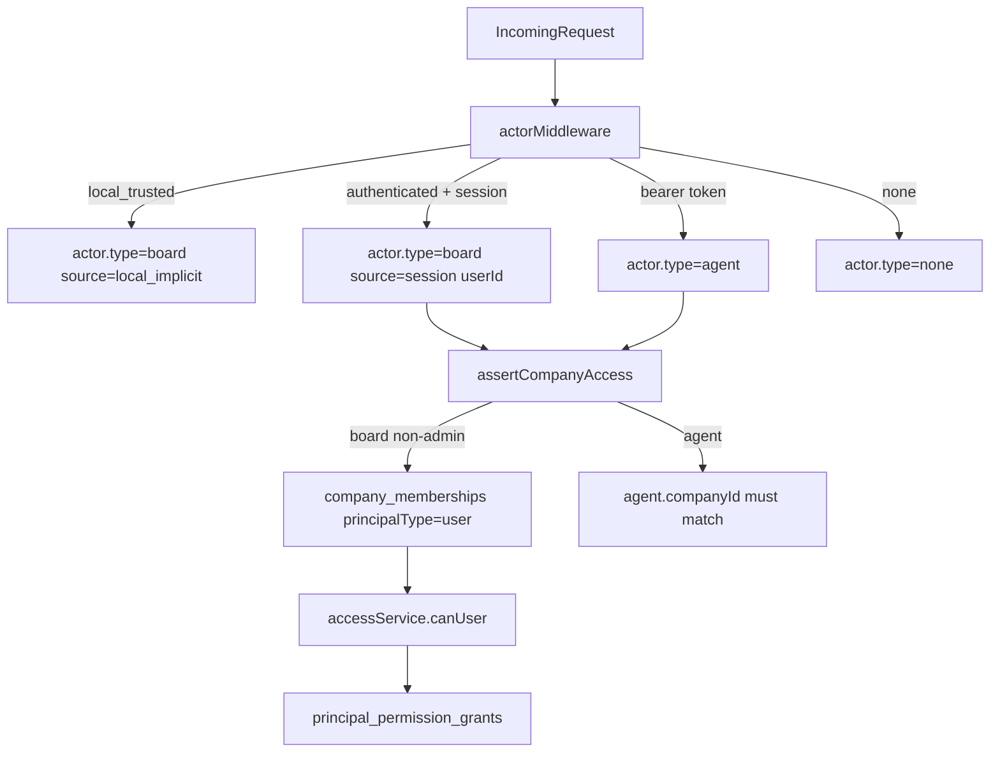

## Current reality (what’s already implemented)

- **Humans already exist as real users** via auth tables in `packages/db/src/schema/auth.ts` (`user`, `session`, etc.).
- The server already distinguishes **human vs agent** with `req.actor.type` and treats any signed-in human as `type: "board"` (see `server/src/middleware/auth.ts`).
- There is already **instance admin** support via `instance_user_roles` (`packages/db/src/schema/instance_user_roles.ts`) and board-claim ownership transfer (`server/src/board-claim.ts`).
- There is already a **company membership model** for both humans and agents in `packages/db/src/schema/company_memberships.ts`:
  - `principalType` = `user|agent`
  - `membershipRole` = free-form string
  - `reportsToMembershipId` = org hierarchy pointer
- There is already a minimal **permissions/grants system** with `principal_permission_grants` (`packages/db/src/schema/principal_permission_grants.ts`) and enforcement helpers (`server/src/services/access.ts`, used heavily in `server/src/routes/access.ts`).
- There are already endpoints that look like “user management”, especially in `server/src/routes/access.ts`:
  - Create human users in authenticated mode: `POST /api/companies/:companyId/human-invites`
  - List members: `GET /api/companies/:companyId/members`
  - Update org config (role + reports-to + managed agents): `PATCH /api/companies/:companyId/members/:memberId/org-config`
  - Update permission grants: `PATCH /api/companies/:companyId/members/:memberId/permissions`
  - Instance-admin operations: `POST /api/admin/users/:userId/promote-instance-admin`, `PUT /api/admin/users/:userId/company-access`, etc.

**Key takeaway:** you don’t need to “add users from scratch”; you mostly need to (a) formalize human roles + org semantics, (b) make management workflows first-class in UI, and (c) remove/relax the “single Board operator” assumption in docs and edge cases.

## Target model (given your answers)

- Keep **“Board” as a concept** but allow **multiple humans**. Implementation-wise, “Board” stays the UI label for “human operator”; technically it remains `req.actor.type === "board"`.
- Support **custom org roles** per company (titles/roles in hierarchy), but **do not hard-enforce** them yet beyond a few critical gates.

## Proposed V1-for-multi-human design

### 1) Formalize user & membership lifecycle

- **Identity**: continue using `authUsers` as canonical human identity.
- **Instance-level control**:
  - `instance_user_roles(role=instance_admin)` remains the “deployment admin” role.
  - Keep board-claim flow as the bootstrap mechanism for first admin in authenticated mode.
- **Company membership** (human access) remains `company_memberships` rows with `principalType="user"`.
- Add/standardize membership states:
  - Use the existing `status` field (`active|suspended|pending` already used in code) for human lifecycle.
  - Enforce: suspended users cannot act in that company.

### 2) Model org hierarchy + custom roles cleanly (without heavy RBAC)

Use existing columns in `company_memberships`:

- **`membershipRole`**: store the org “role/title” string (custom), e.g. `"ceo"`, `"engineering_manager"`, `"operator"`, `"finance"`.
- **`reportsToMembershipId`**: store reporting line for both human and agent members.

Add two small invariants (already partially enforced in `routes/access.ts`):

- No self-reporting and no cycles.
- Reports-to target must be an active member.

Optional (recommended) addition for clarity: document a reserved set of “system roles” vs “custom roles”, e.g.

- `owner` (special; company bootstrap/transfer)
- `member` (default)
- anything else is org metadata only

### 3) Keep permission enforcement minimal, but predictable

Even if “RBAC not important right now”, you still need a couple enforced permissions so management is safe:

- **Instance admin** can manage everything across companies.
- **Company owner** (membershipRole `owner`) can manage that company’s members.
- Otherwise, keep using the existing grant keys for the few sensitive operations already guarded in `server/src/routes/access.ts`, like:
  - `users:invite`
  - `users:manage_permissions`
  - `joins:approve`

Implementation approach:

- Continue to rely on `accessService.canUser(...)` / `accessService.hasPermission(...)` (already implemented in `server/src/services/access.ts`).
- For “custom org roles”, do **not** attempt to automatically map them to permission grants yet.

### 4) Make user management first-class in the UI

Add/finish UI surfaces (likely new pages/components under `ui/src/`):

- **Company → Members page**
  - List members (humans + agents) from `GET /api/companies/:companyId/members`.
  - Edit org metadata:
    - set `membershipRole`
    - set `reportsToMembershipId`
    - optionally manage agent assignments (already supported by `org-config` route)
  - Quick actions:
    - suspend/reactivate member (would require adding a small API route or reusing existing membership update flow)
- **Invite humans** (authenticated mode)
  - Use `POST /api/companies/:companyId/human-invites` (already exists).
  - Show delivery status returned by the endpoint.
- **Instance admin → User directory page** (deployment-wide)
  - Find user by email (may require adding a simple `GET /api/admin/users?query=` endpoint).
  - Promote/demote instance admin.
  - Set company access for a user (`PUT /api/admin/users/:userId/company-access`).

### 5) Update “single Board” assumptions in docs and guardrails

- Update docs that state “single board operator per deployment”:
  - `doc/SPEC-implementation.md` section “Explicit V1 Product Decisions” currently says Board is single.
  - Keep the concept, but revise to: **multiple human operators supported; instance admins are the governing set**.
- Ensure activity log attribution uses real `userId` consistently (it already does in many routes via `getActorInfo(req)` in `server/src/routes/authz.ts`).

### 6) Data migrations and backwards compatibility

- In `local_trusted`, you’ll still have the implicit `local-board` instance admin (`server/src/middleware/auth.ts`).
- In authenticated mode, ensure the bootstrap flow results in at least one `instance_admin` and company memberships for that user (already done in `claimBoardOwnership` in `server/src/board-claim.ts`).
- No schema changes are strictly required to support multiple users (already supported), but you may want a migration to:
  - Normalize any legacy “board” placeholders in `created_by_user_id` columns (if present) to `local-board`.

## Mermaid: Human auth & access control flow

## What I would implement first (incremental)

- **Phase A (management UX)**: Company Members page + invite humans + suspend/reactivate + edit hierarchy.
- **Phase B (admin UX)**: Instance admin user directory + set company access.
- **Phase C (cleanups)**: docs/spec updates; remove hard-coded “single board” UX assumptions; ensure all mutations attribute to real `userId`.

