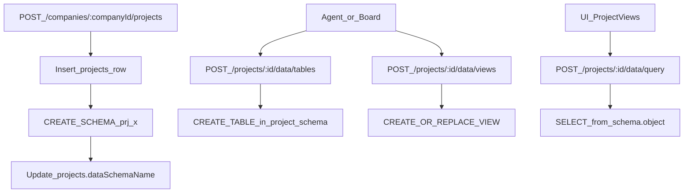

## Goal

Enable each tenant (already isolated by its own DB from `.github/workflows/deploy-tenant.yml`) to support **per-project DB schemas** where agents can create tables and views via a **restricted API**, and a **Project Views** UI that renders safe, config-driven widgets (table/chart/kpi/markdown) against those views.

## Key decisions (aligned to your choices)

- **DB isolation**: Keep tenant isolation at the database level (already done in deploy workflow). Inside the tenant DB, create a **schema per project**.
- **DDL surface**: No raw SQL from agents by default. Provide **restricted endpoints** that generate SQL for allowed operations.
- **UI rendering**: No arbitrary stored React/TSX. Store **widget configs**; UI renders known components.

## Data model changes (Drizzle schema)

- Add columns to `[packages/db/src/schema/projects.ts](/Users/navneet/Desktop/ai-h/ai-harness-app/packages/db/src/schema/projects.ts)`:
  - `dataSchemaName` (text, unique per project within tenant DB) — e.g. `prj_<projectIdShort>`
  - (optional) `dataSchemaVersion` (int) if you want migration/versioning later
- Add new tables (new files under `[packages/db/src/schema/](/Users/navneet/Desktop/ai-h/ai-harness-app/packages/db/src/schema/)` and export from `packages/db/src/schema/index.ts`):
  - `project_data_objects`
    - `id`, `companyId`, `projectId`
    - `kind`: `table` | `view`
    - `name` (object name within schema)
    - `definition` (JSONB) — for tables: columns + types; for views: select spec
    - `createdByActorType`, `createdByUserId`, `createdByAgentId`
    - timestamps
  - `project_views`
    - `id`, `companyId`, `projectId`, `name`
    - timestamps
  - `project_view_widgets`
    - `id`, `companyId`, `projectId`, `projectViewId`
    - `type`: `table` | `kpi` | `chart` | `markdown`
    - `queryRef` (e.g. `{ kind: 'view', name: 'my_view' }`)
    - `config` (JSONB) (columns to show, chart axes, formatting)
    - `layout` (JSONB) minimal grid positioning
    - timestamps

## Runtime schema creation

- On project creation in `[server/src/routes/projects.ts](/Users/navneet/Desktop/ai-h/ai-harness-app/server/src/routes/projects.ts)` (after `svc.create` succeeds), call a new service that:
  - Computes schema name (deterministic, sanitized, length-safe).
  - Executes `CREATE SCHEMA IF NOT EXISTS <schemaName>`.
  - Stores `dataSchemaName` back onto the project row.
- Provide idempotency and handle collisions (if schema name already used, suffix with short hash).

## Restricted DDL API (server)

Add new routes under `/api/projects/:id/data/`* (company/project access enforced):

- `POST /projects/:id/data/tables`
  - Body: `{ name, columns: [{ name, type, nullable, default? }], primaryKey? }`
  - Server validates allowed column types (e.g. `text`, `int`, `numeric`, `bool`, `uuid`, `timestamptz`, `jsonb`) and safe identifiers.
  - Generates and runs `CREATE TABLE <schema>.<name> (...)`.
  - Records a row in `project_data_objects`.
- `POST /projects/:id/data/views`
  - Body: `{ name, from: { table|view }, select: [...], filters?, groupBy?, orderBy?, limit? }`
  - Server generates `CREATE OR REPLACE VIEW <schema>.<name> AS SELECT ...`.
  - Records `project_data_objects`.
- `POST /projects/:id/data/query`
  - Body: `{ ref: { kind:'view'|'table', name }, limit?, offset?, orderBy? }`
  - Server executes `SELECT * FROM <schema>.<ref> ...` and returns rows.

### AuthZ rules

- Reuse existing patterns from agents/projects routes (`assertCompanyAccess`).
- Allow both board users and agents to create objects (per your answer), but:
  - Enforce **project scoping**: agent key must belong to same company and only operate on projects in that company.
  - Add a permission gate for DDL if desired later (e.g. `projects:data:ddl`).

## UI: Project Views

- Add UI API client module (e.g. `ui/src/api/projectData.ts`) to call the new endpoints.
- Add a new page/section on the project screen to:
  - Create/manage data tables and views (forms; show status/errors).
  - Create a “Project View” (dashboard) and add widgets.
  - Render widgets using existing UI components (table + simple chart library already in repo, if any; otherwise add a minimal chart renderer).

## “Agents should be made aware”

- Extend agent prompt/instructions (engineering instructions injection already exists in `server/src/services/agents.ts`) to include a short capability description:
  - How to create a project dataset table/view via the restricted API.
  - Naming conventions and safety constraints.
  - How to attach widgets to a Project View for presentation.
- Also expose these capabilities via `/api/agents/me` response metadata if you want programmatic discovery.

## Verification

- Add server tests for:
  - Schema creation on project create.
  - DDL endpoints validation (reject bad identifiers/types).
  - Cross-company access rejection.
- Run `pnpm db:generate` (new migration), `pnpm -r typecheck`, and update any affected shared types/validators.

